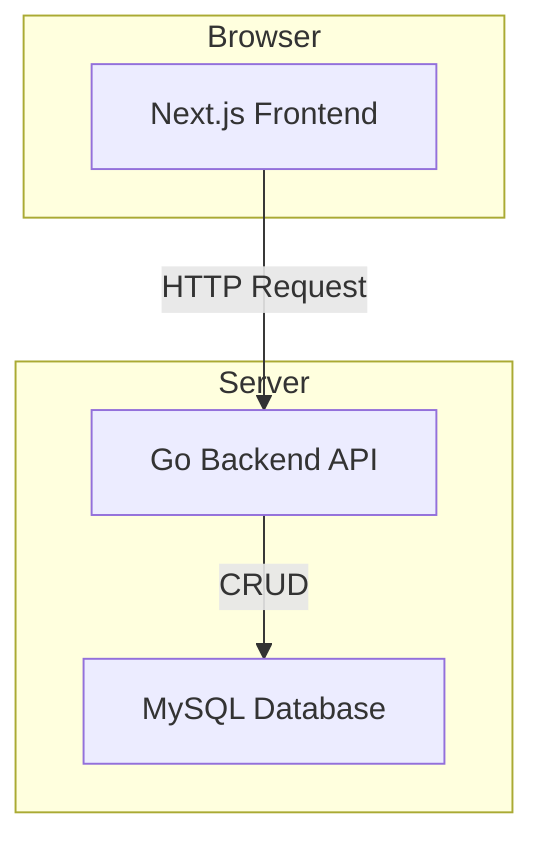

# 概要
Simple Blogは、Next.jsとGoを使用して構築されたブログプラットフォームです。

## 主な使用技術
- フロントエンド
  - 言語：TypeScript
  - フレームワーク：Next.js(App Router)
  - スタイル：SCSS, Tailwind CSS
  - コード整形・静的解析：Prettier・ESLint
- バックエンド
  - 言語：Go
  - フレームワーク：Echo
  - コンテナ：Docker
  - ORM：GORM
- データベース：MySQL (Docker Compose経由)
- API仕様：Swagger (Swag)

## システム構成図


## ブランチ管理
- main
  - 本番用のソースコードを管理するブランチ
- develop
  - 開発作業用のブランチ
  - 普段の開発はこのブランチからfeatureブランチを切る
- feature
  - developブランチから作成するブランチ
  - 新しい機能の開発など
  - ブランチ名は`feature/{issue番号}-{作業内容}`
     - 例: `feature/1-create-login-page`

# フロントエンド環境 (web-frontend)
## 前提条件
- Node.js (v18以上推奨)
- npm

## パッケージのインストール
```bash
# web-frontendディレクトリに移動
cd web-frontend

# パッケージのインストール
npm install
```

## APIクライアントコードの自動生成
バックエンドサーバーを起動した状態で、以下のコマンドを実行すると、`src/app/api/`配下にAPIクライアントコードが生成されます。

```bash
# web-frontendディレクトリにいることを確認
# openapi.jsonの更新
curl http://localhost:8080/swagger/doc.json -o openapitools/openapi.json

# OpenAPI GeneratorによるTypeScriptクライアントの生成
npm run openapi-gen
```

## ローカルサーバーの起動
`npm run dev`を実行後、 http://localhost:3000 にアクセスしてください。

## ディレクトリ構成
```
web-frontend/
├── src/
│   ├── app/                # ページルーティング定義
│   │   ├── api/            # 自動生成したAPIクライアントコード
│   │   ├── components/     # UIコンポーネント群
│   │   ├── hooks/          # React用のカスタムフック
│   │   └── libs/           # 汎用ロジックやユーティリティ関数
│   └── scss/               # スタイル定義
├── openapitools/
│   └── openapi.json        # バックエンドから取得したOpenAPIスキーマファイル
└── package.json            # 依存パッケージ・スクリプト定義
```

# バックエンド環境 (backend)
## 前提条件
- Go
- Docker
- Docker Compose

## ローカルサーバーの起動
プロジェクトのルートディレクトリで以下のコマンドを実行してください。
`docker-compose up --build` を実行後、 http://localhost:8080 にアクセスするとバックエンドサーバーが起動します。

## ディレクトリ構成
```
backend/
├── cmd/
│   └── backend/
│       └── main.go         # アプリのエントリーポイント
├── config/                 # 設定ファイル関連
├── internal/
│   ├── handler/            # HTTPリクエストの処理
│   ├── model/              # データ構造の定義
│   ├── repository/         # DBとのやり取り
│   ├── seeder/             # 初期データ投入
│   └── service/            # ビジネスロジック
├── go.mod                  # 依存パッケージ管理
├── Dockerfile              # Dockerイメージ定義
└── ...
```

## APIドキュメントの確認
ローカルサーバーを起動後、以下のURLにアクセスするとSwagger UIでAPIドキュメントを確認できます。
- http://localhost:8080/swagger/index.html

# コード自動整形
VSCodeの拡張機能を検索し、
- Prettier - Code Formatter
- ESLint
- Go
をインストール後、VSCodeの`settings.json`に以下を記述してください。

```json
{
  // 共通設定
  "editor.formatOnSave": true,
  "editor.codeActionsOnSave": {
    "source.organizeImports": "always",
    "source.fixAll": "always"
  },

  // Go用
  "[go]": {
    "editor.defaultFormatter": "golang.go"
  },

  // TypeScript/JavaScript用
  "[typescript]": {
    "editor.defaultFormatter": "esbenp.prettier-vscode"
  },
  "[typescriptreact]": {
    "editor.defaultFormatter": "esbenp.prettier-vscode"
  },
  "[javascript]": {
    "editor.defaultFormatter": "esbenp.prettier-vscode"
  },
  "[javascriptreact]": {
    "editor.defaultFormatter": "esbenp.prettier-vscode"
  }
}
```
設定後、ファイル保存時にコード整形とインポート整理・不要インポート削除が実行されます。


### Gemini CLIの実行
npx https://github.com/google-gemini/gemini-cli

