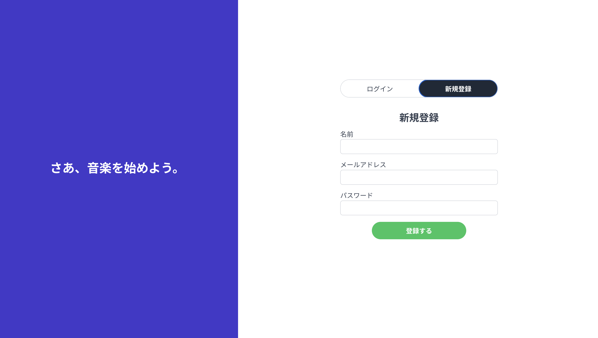
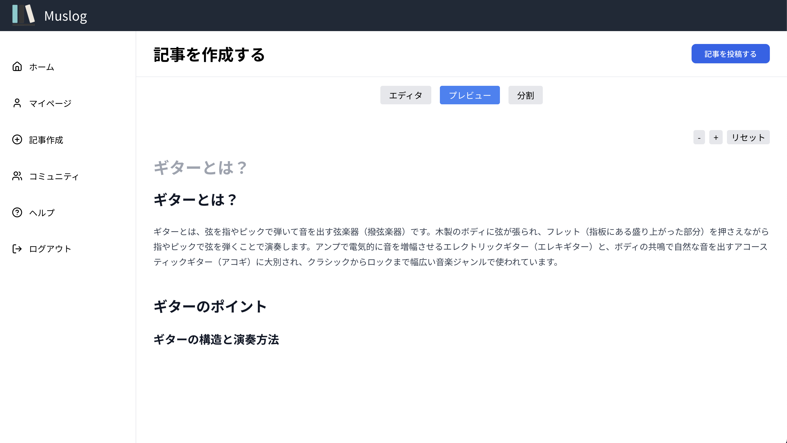

# 概要
**プレビュー環境URL**：https://muslog-git-preview-southvillages-projects.vercel.app/

音楽理論や作曲したオリジナル曲、ギターの演奏動画を投稿したいと思い、音楽に関する技術記事を投稿できるプラットフォームを作りました。マークダウンで記事を投稿でき、タグや SpotifyAPI から検索した曲を選択して紹介する機能も作りました。また、WebSocket 通信を用いてリアルタイムチャットのできるコミュニティ機能も作成しました。インフラ〜フロントエンドまで一度自力で開発してみたいと思い、
AWS 構築を Terraform による IaC、GoによるAPIサーバー、Next.jsによるフロントエンド実装まで行いました。また、AWS ECS への自動デプロイなどの CI / CD も GitHub Actions を使用して実現しています。（運用コストが高く、現在は運用停止中です）

フロントエンドは Figma を使用してデザイン案を構想し、Next.js での UI 実装まで行いました。初めは AWS 環境でホスティングに CloudFront を使用していたため、Next.js の強みである SSR（サーバーサイドレンダリング）を使用できないという制約の中開発を進めていましたが、結局 Lambda@Edge、OpenNext 等を使用し SSR できるようなインフラ環境に変更しました。デザインの再現には Codex や Claude Code などの AI エージェントを多用し、効率的な実装に務めました。

バックエンドは Golang の Echo フレームワークを用いて、クリーンアーキテクチャを中心としたディレクトリ構造での API 開発を行いました。クリーンアーキテクチャを実際にアプリケーションコードに落とし込む技術を学ぶ非常に良い経験となりました。

今後の展望：
現状のインフラ環境では、WebSocket 通信用サーバーと RESTfulAPI 用サーバーが 1 つの ECS コンテナで稼働している状態であり、あまりスケーラブルでない構成です。
今後、記事投稿、コミュニティに加えて、他の機能を追加するとなった場合に備えて、現状のモノリシックアーキテクチャから、gRPC をマイクロサービスへと再編成したいです。

## 主な使用技術

- フロントエンド
  - 言語：TypeScript
  - フレームワーク：Next.js(App Router)
  - スタイル：SCSS, Tailwind CSS
- バックエンド
  - 言語：Go
  - フレームワーク：Echo
  - コンテナ：Docker
  - ORM：GORM
- データベース：PostgreSQL
- インフラ, IaC：AWS, Terraform
- CI/CD：GitHubActions

## インフラ構成図

_インフラ構成図_

## ER図

_ER図_

## ページ一覧
ログイン前
- ログイン、新規登録ページ

_新規登録ページ_

_ログインページ_
- ヘルプページ

_ヘルプページ_

_利用ガイド_

ログイン後
- 記事一覧ページ

_記事一覧ページ_

_記事検索結果_

- マイページ

_マイページ_
- 新規記事作成ページ

_新規記事作成ページ（分割）_

_新規記事作成ページ（プレビュー）_

_新規記事作成ページ（エディタ）_

_ヘッダー画像アップロード_

_タグの追加_

_曲の挿入_
- 投稿詳細ページ

_投稿詳細ページ_
- 投稿編集ページ

_投稿編集ページ_
- コミュニティ作成、検索ページ

_コミュニティ作成、検索ページ_
- コミュニティ詳細ページ

_コミュニティ詳細ページ_

*レスポンシブ対応済みです。
## ブランチ管理

- main
  - 本番用のソースコードを管理するブランチ
- preview
  - プレビュー用のソースコードを管理するブランチ
  - フロントのデプロイにVercel, バックエンドDockerコンテナとDBのデプロイにはRenderを使用
- develop
  - 開発作業用のブランチ
  - 普段の開発はこのブランチから feature ブランチを切る
- feature
  - develop ブランチから作成するブランチ
  - 新しい機能の開発など
  - ブランチ名は`feature/{作業内容}`
    - 例: `feature/create-login-page`

# フロントエンド環境 (frontend)

## 前提条件

- Node.js 22.6 以上（`frontend/.node-version` 参照）
- npm 10.8 以上

## パッケージのインストール

```bash
# フロントエンド
cd frontend
npm install
```

## ローカルサーバーの起動

```bash
cd frontend
npm run dev
```
http://localhost:3000 にアクセスしてください。

## ディレクトリ構成

```
frontend/                         
├── openapi.yml                   # OpenAPI定義
└── src/                          
    ├── app/                 
    │   ├── dashboard/            # ダッシュボード
    │   │   ├── post/             
    │   │   │   ├── [id]/         # 投稿詳細ページ
    │   │   │   │   └── edit/     # 投稿編集ページ
    │   │   │   └── add           # 投稿新規作成ページ
    │   │   ├── me                # マイページ
    │   │   ├── help              # ヘルプページ
    │   │   └── community/        # コミュニティページ
    │   │       └── [communtiy]   # コミュニティ詳細ページ
    │   ├── login-or-signup       # ログイン・サインアップページ
    │   ├── page.tsx              # トップページ
    │   └── providers.tsx         # プロバイダー（Contextや状態管理のラッパー）
    ├── components                # 再利用可能なUIコンポーネント群
    ├── libs/                     # ライブラリ・ユーティリティ関連
    │   ├── api                   # API クライアント（OpenAPI Generatorやfetch wrapper）
    │   ├── store                 # Redux状態管理
    │   └── websocket             # WebSocket 関連の処理
    ├── contexts                  # React Context 定義
    ├── constants                 # 定数
    ├── hooks                     # カスタムフック群
    └── scss                      # スタイルシート（SCSSファイル）
```


# バックエンド環境 (backend)

## 前提条件

- Go
- Docker

## ローカルサーバーの起動

プロジェクトのルートディレクトリで以下のコマンドを実行してください。

```bash
docker-compose up --build
```
起動後、http://localhost:8080にアクセス

## ディレクトリ構成

```
backend/
├── cmd/
│   ├── backend/main.go         # Echo 起動、DI、マイグレーション、シード
│   └── scheduler/              # スケジューラ用エントリ
├── config/                     # 設定ロード
├── internal/
│   ├── adapter/                # インターフェイスアダプタ層
│   │   ├── dto/                # DTO定義
│   │   └── handler/            # HTTPハンドラ定義
│   ├── domain/                 # ドメイン層
│   │   ├── entity/             # エンティティ
│   │   └── repository/         # リポジトリのインターフェイス
│   ├── infrastructure/         # ドライバー・フレームワーク層
│   │   ├── model/              # GORMモデル定義
│   │   ├── repository/         # リポジトリ実装
│   │   ├── mapper/             # モデルマッピング
│   │   └── logger/             # ログ定義
│   ├── middleware/             # 認証等ミドルウェア
│   ├── seeder/                 # 初期データ投入
│   └── usecase/                # ユースケース層
├── pkg/utils/                  # 共通ユーティリティ
├── scripts/                    # 補助スクリプト
└── test/                       # テスト
```

## テーブルの確認

```
# dbコンテナに直接入る
docker-compose exec -it db bash
# PostgreSQLに移動
psql -U postgres -d simpleblog
# 特定のテーブルの中身を確認
SELECT * FROM <テーブル名>;
# 特定のテーブルの中身を削除
TRUNCATE TABLE <テーブル名> CASCADE;
# テーブル一覧を確認
\dt:
```

## テスト
```
# テスト実行
go test ./internal/usecase
# カバレッジの表示
go test -cover ./internal/usecase
```

# コード自動整形
VSCode の拡張機能を検索し、

- Prettier - Code Formatter
- ESLint
- Go
  をインストール後、VSCode の`settings.json`に以下を記述してください。

```json
{
  // 共通設定
  "editor.formatOnSave": true,
  "editor.codeActionsOnSave": {
    "source.fixAll.eslint": "always"
  },
  "eslint.validate": ["javascript", "javascriptreact", "typescript", "typescriptreact"],

  // JS・TS用
  "[typescript]": {
    "editor.defaultFormatter": "esbenp.prettier-vscode"
  },
  "[typescriptreact]": {
    "editor.defaultFormatter": "esbenp.prettier-vscode"
  },
  "[javascript]": {
    "editor.defaultFormatter": "esbenp.prettier-vscode"
  },
  "[javascriptreact]": {
    "editor.defaultFormatter": "esbenp.prettier-vscode"
  },
  // Go用
  "[go]": {
    "editor.defaultFormatter": "golang.go"
  }
}
```

設定後、ファイル保存時にコード整形とインポート整理・不要インポート削除が実行されます。

# AWS 本番環境構築 (Terraform)

## 前提条件

- AWS CLI 設定済み
- Terraform (v1.0 以上推奨)
- 適切な IAM ロール・権限

## デプロイ手順

```bash
# 本番環境のTerraformディレクトリに移動
cd terraform/environments/production

# Terraform初期化
terraform init

# 実行計画確認
terraform plan

# インフラ構築
terraform apply
```

## インフラ構成詳細

- **CloudFront**: CDN によるキャッシュ・HTTPS 配信
- **ALB**: API 用ロードバランサー (/api/\* へのリクエストルーティング)
- **S3**: 静的ファイル配信 (HTML/CSS/JS) + 画像・音源保存
- **ECS Fargate**: Go アプリケーションのコンテナ実行
- **ECR**: Docker イメージレジストリ
- **RDS PostgreSQL**: データベース
- **CloudWatch**: ログ・メトリクス監視

### リクエストフロー

1. **静的ファイル**: ユーザー → CloudFront → S3
2. **API リクエスト**: ユーザー → CloudFront → ALB → ECS Fargate
3. **画像アップロード**: ユーザー → 署名付き URL → S3 → CloudFront 配信
4. **コンテナデプロイ**: GitHub Actions → docker build → ECR → ECS

### 追記推奨（今後の記載候補）
- フロント/バックの環境変数一覧（`.env.local`、`.env`）
- 認証フロー（Auth Cookie、Refresh/Access の寿命）
- API クライアント生成の運用ルール（openapi.yml の更新手順）
- Docker サービス構成（ALB/ECS/DB とローカルの差分）
- シーダー仕様（投入ユーザー、投稿件数、再実行時の挙動）

# その他開発・運用コマンド

### Gemini CLI の実行

npx https://github.com/google-gemini/gemini-cli
gemini -m "gemini-2.5-flash" --yolo

### Claude code の実行

claude --dangerously-skip-permissions

### Coeexの実行
codex

## AWS リソースの停止・開始

本番環境のコストを抑えるために、ECS と RDS を手動で停止・開始できます。

### 停止

```bash
# 手動でリソースを停止（ECSとRDS両方）
aws ssm start-automation-execution \
    --document-name "production-run-scheduler-task" \
    --parameters "Action=stop"
```

### 開始

```bash
# 手動でリソースを開始（ECSとRDS両方）
aws ssm start-automation-execution \
    --document-name "production-run-scheduler-task" \
    --parameters "Action=start"
```

### 実行状況の確認

```bash
# 実行状況を確認
aws ssm describe-automation-executions \
    --filters "Key=DocumentName,Values=production-run-scheduler-task" \
    --max-results 3

# ECSサービスの状態確認
aws ecs describe-services \
    --cluster "production-cluster" \
    --services "production-backend-service" \
    --query "services[0].{ServiceName:serviceName,DesiredCount:desiredCount,RunningCount:runningCount}"

# RDSクラスターの状態確認
aws rds describe-db-clusters \
    --query "DBClusters[?contains(DBClusterIdentifier, 'production')].{Identifier:DBClusterIdentifier,Status:Status}"
```

**注意事項:**

- 停止: ECS の desired count が 0 になり、RDS が stopping → stopped 状態になります
- 開始: RDS が starting → available 状態になり、ECS の desired count が 2 に戻ります
- RDS の停止・開始は数分かかることがあります

# その他メモ
aws secretsmanager delete-secret --secret-id production/app_secrets --region ap-northeast-1

aws secretsmanager delete-secret --secret-id production/app_secrets --region ap-northeast-1 --force-delete-without-recovery

aws logs describe-log-groups --region ap-northeast-1 --log-
group-name-prefix "/aws/lambda/production-open-next-regional"
--query 'logGroups[].logGroupName' --output text
