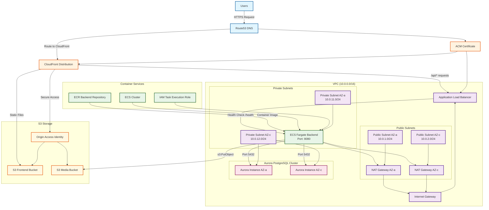

# AWS Infrastructure Diagram

## Simple Blog Production Environment

## アーキテクチャ概要

### フロントエンド配信
- **S3 + CloudFront**: 静的ファイル（HTML/CSS/JS）の高速配信
- **Route53**: ドメイン名解決とDNS管理
- **ACM**: SSL/TLS証明書による暗号化通信

### バックエンドAPI
- **ECS Fargate**: サーバーレスコンテナでバックエンドAPI実行
- **ALB**: ロードバランシングとHTTPS終端
- **ECR**: Dockerイメージの管理

### データベース
- **Aurora PostgreSQL**: 高可用性クラスター構成
- **マルチAZ**: 冗長性とフェイルオーバー対応

### セキュリティ
- **VPC**: プライベートネットワーク分離
- **セキュリティグループ**: ファイアウォール設定
- **NAT Gateway**: プライベートサブネットからの安全な外部通信

### 主要な特徴
- **完全にサーバーレス**: ECS Fargateによる管理不要なコンテナ実行
- **高可用性**: マルチAZ構成による冗長性
- **セキュア**: プライベートサブネットでの機密データ処理
- **スケーラブル**: CloudFrontとECS Fargateによる自動スケーリング
- **コスト効率**: 使用量ベースの課金によるコスト最適化

### トラフィックフロー
1. ユーザーがドメインにアクセス
2. Route53がCloudFrontにルーティング
3. CloudFrontが静的ファイルはS3から、APIリクエスト（/api/*）はALBから配信
4. ALBがECS Fargateのバックエンドコンテナにルーティング
5. バックエンドがAurora PostgreSQLクラスターにアクセス